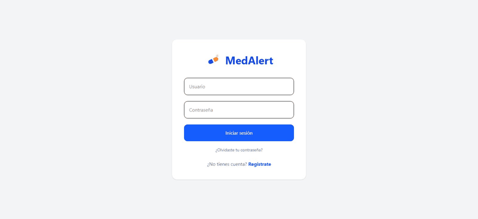
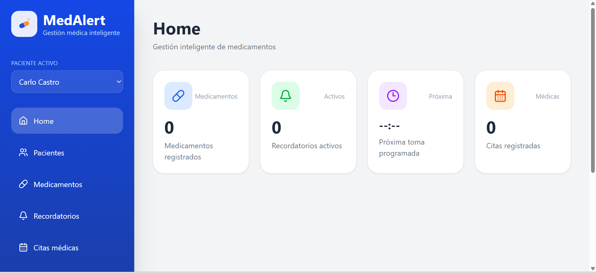
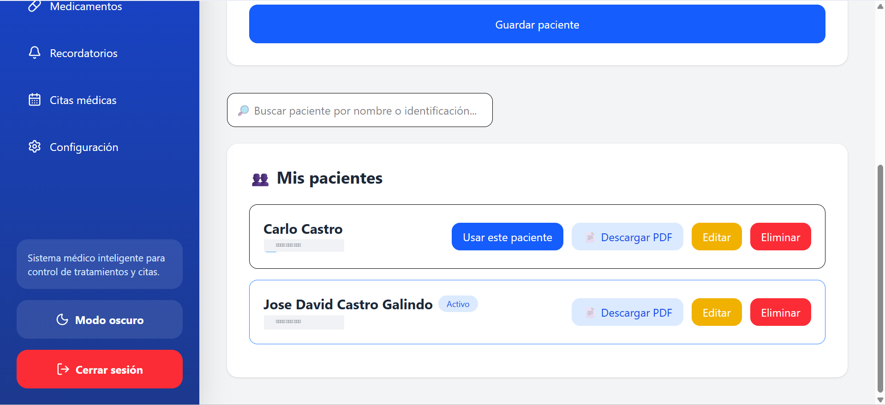
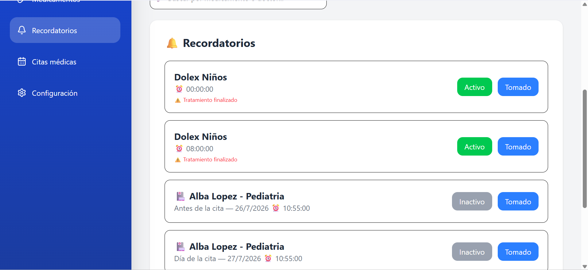

# 💊 MedAlert

Aplicación web para que un **cuidador** administre los medicamentos, recordatorios y citas médicas de una o varias personas a su cargo (pacientes). Genera recordatorios automáticamente, envía notificaciones por WhatsApp, y produce reportes en PDF por paciente.

## Capturas



| Home | Pacientes | Recordatorios |
|---|---|---|
|  |  |  |

## Funcionalidades

- Registro de cuidador con datos personales (nombre, identificación, género)
- Gestión de múltiples pacientes por cuidador, sin límite
- Medicamentos con frecuencia y duración configurables — genera automáticamente los recordatorios de cada toma
- Citas médicas (consulta, examen, terapia, cirugía) con recordatorios automáticos (anticipado + el día de la cita)
- Notificaciones por WhatsApp (vía [CallMeBot](https://www.callmebot.com/blog/free-api-whatsapp-messages/), gratis)
- Recuperación de contraseña por correo
- Reporte en PDF por paciente: medicamentos, estado del tratamiento, historial de tomas y citas
- Modo oscuro, búsqueda y filtros, navegación responsive (escritorio y celular)

## Tecnologías

**Backend:** Django 6 + Django REST Framework, JWT (simplejwt), SQLite, ReportLab (PDF)
**Frontend:** Vue 3 + TypeScript + Vite, Tailwind CSS, Vitest

## Requisitos previos

- Python 3.12+
- Node.js 22+
- npm

## Instalación

### 1. Clonar el repositorio

```bash
git clone <url-de-tu-repositorio>
cd MedAlert
```

### 2. Backend

```bash
cd backend
python -m venv venv

# Windows
.\venv\Scripts\Activate.ps1
# macOS/Linux
source venv/bin/activate

pip install -r requirements.txt
```

Crea tu archivo de variables de entorno a partir de la plantilla:

```bash
cp .env.example .env
```

Genera una `SECRET_KEY` propia y colócala en `.env`:

```bash
python -c "import secrets; print(secrets.token_urlsafe(50))"
```

Aplica las migraciones y levanta el servidor:

```bash
python manage.py migrate
python manage.py runserver
```

El backend queda disponible en `http://127.0.0.1:8000/`.

### 3. Frontend

En otra terminal:

```bash
cd frontend
npm install
```

Crea tu archivo de variables de entorno:

```bash
cp .env.example .env
```

Levanta el servidor de desarrollo:

```bash
npm run dev
```

El frontend queda disponible en `http://localhost:5173/`.

## Variables de entorno

### Backend (`backend/.env`)

| Variable | Descripción | Valor por defecto |
|---|---|---|
| `DJANGO_SECRET_KEY` | Clave secreta de Django (obligatoria) | — |
| `DJANGO_DEBUG` | Modo debug | `True` |
| `DJANGO_ALLOWED_HOSTS` | Hosts permitidos, separados por coma | `127.0.0.1,localhost` |
| `CORS_ALLOWED_ORIGINS` | Orígenes permitidos para el frontend | `http://localhost:5173` |
| `EMAIL_BACKEND` | Backend de correo (recuperar contraseña) | Consola (imprime el correo en la terminal) |
| `FRONTEND_URL` | URL del frontend, para armar el enlace de recuperación | `http://localhost:5173` |

Ver `backend/.env.example` para la lista completa, incluyendo cómo configurar un correo SMTP real.

### Frontend (`frontend/.env`)

| Variable | Descripción |
|---|---|
| `VITE_API_URL` | URL base de la API del backend |

## Notificaciones por WhatsApp (opcional)

MedAlert puede avisarte por WhatsApp cuando es hora de un medicamento o cita, usando el servicio gratuito CallMeBot. La configuración se hace desde la app, en **Configuración**, siguiendo las instrucciones en pantalla.

Para que las notificaciones se envíen a la hora exacta, deja corriendo en una terminal aparte:

```bash
cd backend
python manage.py enviar_recordatorios_whatsapp --loop
```

## Pruebas

### Backend

```bash
cd backend
python manage.py test
```

### Frontend

```bash
cd frontend
npm run test
```

## Estructura del proyecto

```
MedAlert/
├── backend/
│   ├── config/            # Configuración de Django (settings, urls)
│   ├── medications/        # App principal: modelos, vistas, serializers, pruebas
│   └── static/              # Logo usado en el PDF
└── frontend/
    └── src/
        ├── api/            # Cliente axios
        ├── components/     # Componentes reutilizables, por dominio
        ├── composables/    # Lógica compartida (tema, paciente activo, menú móvil)
        ├── layouts/        # Layout con sidebar
        ├── router/         # Rutas
        └── views/          # Páginas
```
